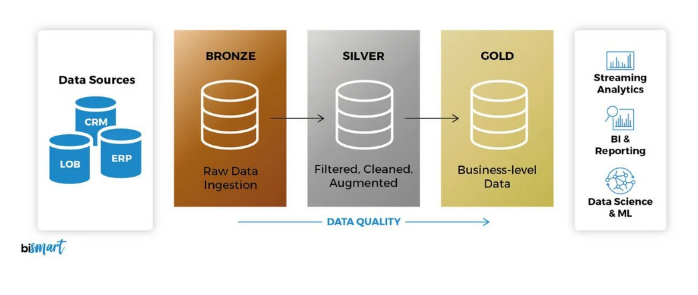
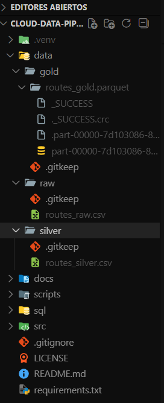
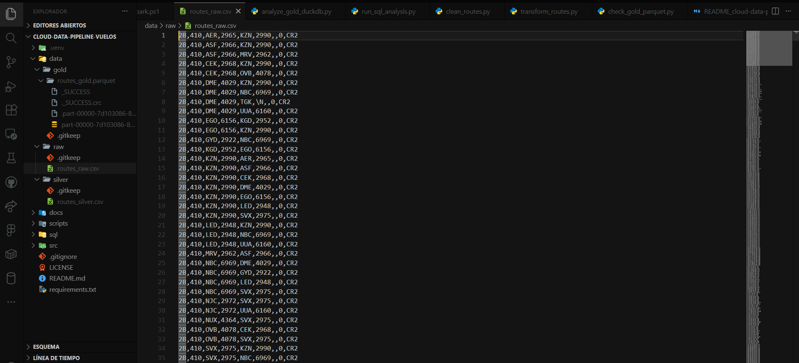
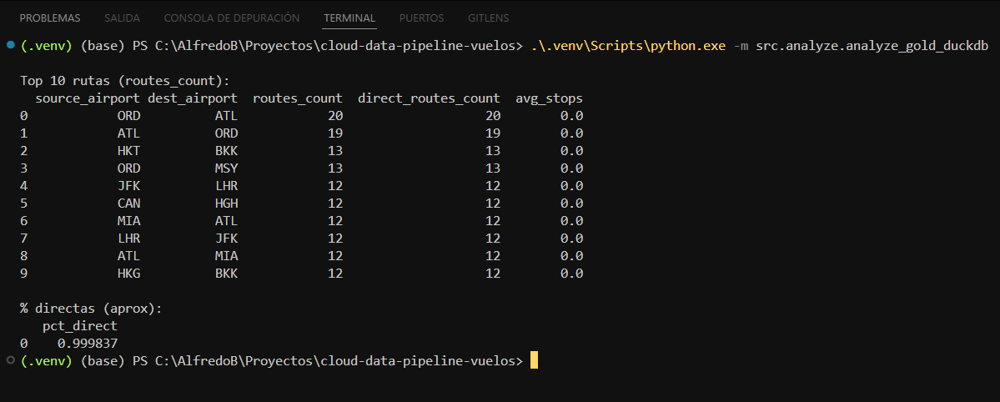

# Cloud Data Pipeline – Análisis de Datos de Vuelos ✈️☁️

Pipeline de datos **tipo Cloud Data Engineering** ejecutado localmente, siguiendo el patrón **Medallion (Raw → Silver → Gold)**.

- **Raw**: datos crudos descargados (CSV sin headers)
- **Silver**: datos limpios y estandarizados (CSV)
- **Gold**: métricas listas para análisis/BI (Parquet)



> En un escenario real: **Raw/Silver** vivirían en un Data Lake (**S3 / ADLS**) y **Gold** se consultaría desde un motor analítico (**Databricks SQL / Snowflake**) para dashboards.

---

## ✅ Qué resuelve este proyecto

1. Ingesta de datos crudos de rutas aéreas (dataset público).
2. Limpieza con **Python + Pandas** (estructurar columnas, tipos y validaciones).
3. Transformación y agregaciones con **PySpark** (generar dataset Gold y métricas).
4. Consulta analítica con **DuckDB (SQL)** sobre el Parquet final.
5. Estructura de repo y scripts reproducibles tipo "pipeline".

---

## 🧱 Arquitectura (simulación Cloud)

```text
data/raw    (CSV crudo)
   ↓  src/clean (Pandas)
data/silver (CSV limpio)
   ↓  src/transform (PySpark)
data/gold   (Parquet listo para analítica)
   ↓  src/analyze (DuckDB/SQL)
Resultados / métricas para BI
```

**Mapping a Cloud real:**
- `data/raw` → **S3 / ADLS Gen2** (landing/raw)
- `data/silver` → **S3/ADLS** (curated/clean)
- `data/gold` → **Databricks Delta / Snowflake tables**
- `src/transform` → **Spark en Databricks / EMR**
- `src/analyze` → **Databricks SQL / Snowflake / Athena**

---

## 📁 Estructura del repositorio

```text
cloud-data-pipeline-vuelos/
  data/
    raw/
    silver/
    gold/
  src/
    utils/
    ingest/
    clean/
    transform/
    analyze/
  sql/
  docs/
```

---

## ⚙️ Requisitos

- Windows + PowerShell (recomendado para este repo)
- Python 3.11
- Java 17 (para Spark)
- Dependencias Python (requirements.txt)

---

## 🚀 Cómo ejecutar

### 1) Crear y activar entorno

```powershell
py -3.11 -m venv .\.venv
.\.venv\Scripts\python.exe -m pip install --upgrade pip
.\.venv\Scripts\python.exe -m pip install -r requirements.txt
```

> Nota: En Windows, Spark suele requerir variables de entorno para evitar que busque `python3`.
> Usa el script de ejecución que viene en el repo (ver siguiente sección).

---

### 2) Ingesta: descargar dataset a Raw

Guarda el archivo como:

```text
data/raw/routes_raw.csv
```

Dataset sugerido: **OpenFlights Routes** (archivo `routes.dat`).
El dataset raw proviene de OpenFlights, un proyecto público que mantiene información abierta sobre aeropuertos, aerolíneas y rutas aéreas.

- El archivo no trae headers. Se renombra a `routes_raw.csv`.


---

### 3) Limpieza (Raw → Silver) con Pandas

```powershell
.\.venv\Scripts\python.exe -m src.clean.clean_routes
```

Salida:
- `data/silver/routes_silver.csv`

En Silver, cada fila representa una ruta individual, algo así como:

airline | source_airport | dest_airport | stops | equipment

En Silver:
- Quitamos nulos.
- Arreglamos tipos.
- Normalizamos valores.

---

### 4) Transformación (Silver → Gold) con PySpark

```powershell
.\.venv\Scripts\python.exe -m src.transform.transform_routes
```

Salida:
- `data/gold/routes_gold.parquet/` (carpeta Parquet con `part-...` y `_SUCCESS`)

En Gold:
- Cambiamos la forma del dataset.
- Cambiamos el nivel de granularidad.
- Creamos métricas.

Creamos nuevas columnas específicas:

source_airport	| dest_airport |	routes_count	| direct_routes_count |	avg_stops

Buscando eliminar ruido para responder: ¿Cuáles son las rutas más frecuentes y qué tan directas son?

---

### 5) Validación rápida del Parquet

```powershell
.\.venv\Scripts\python.exe -m src.transform.check_gold_parquet
```

---

### 6) Análisis con SQL (DuckDB)

```powershell
.\.venv\Scripts\python.exe -m src.analyze.analyze_gold_duckdb
```


Ejemplos de outputs:
- Top rutas por cantidad de vuelos (routes_count)
- Porcentaje aproximado de rutas directas

---

## 🧪 Notas de Windows + Spark

- Los warnings sobre `winutils.exe` son comunes en Windows.
- Se mitigó configurando ejecución y variables para que Spark use el Python del `.venv`.
- El dataset Gold es **Parquet**, formato típico de Data Lakes.

---

## Licencia

Este repositorio puede publicarse como **MIT** para permitir uso libre (recomendado para portafolio).

---

## Autor

**Berrocal0406**  
Proyecto de portafolio orientado a **Cloud Data Engineering** (Python, SQL, PySpark).
